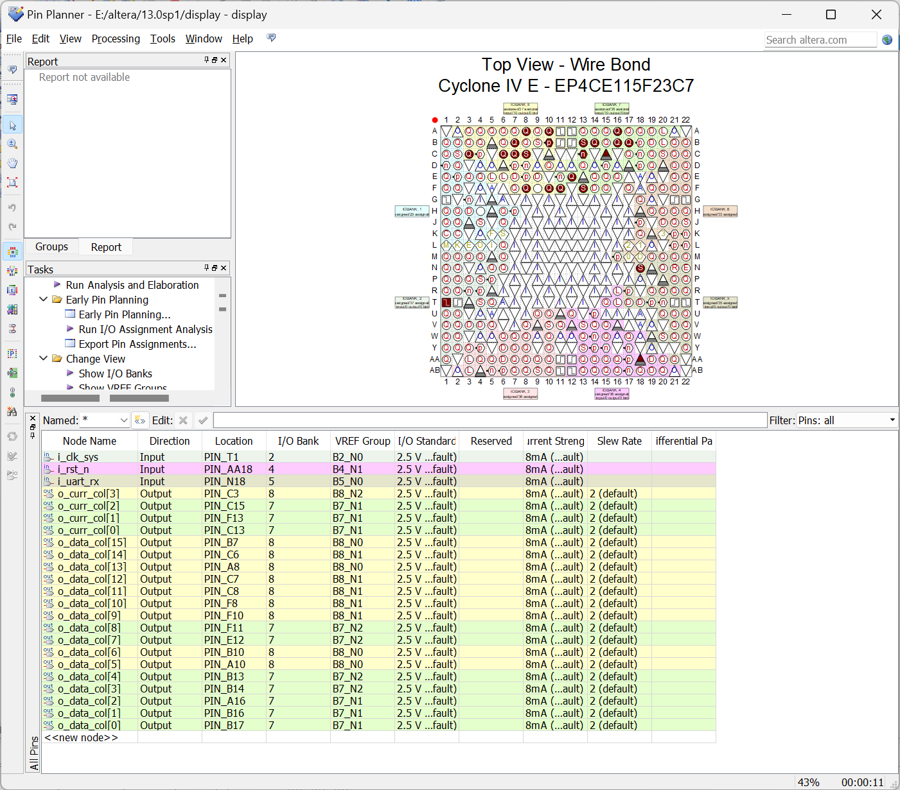

# FPGA PLAYGROUND

FPGA playground provides multiple small games or applications based on EP4CE115F23C7.

# Environment

node: v23.3.0

uv: 0.5.5

# Usage

1. Create a quartus project, add the Verilog files in the verilog folder to the project, compile and download.
The pin binding is as shown in the figure:

2. Connect the UART interface on the development board to the USB interface on the computer, and select the corresponding serial port number in the program. 
3. Then start your fun journey.

# Development

```sh
# Install dependencies
npm install
# Run the app in development mode
npm run start
# Package the app
npm run package
# Make the app
npm run make
# Publish the app
npm run publish
```
